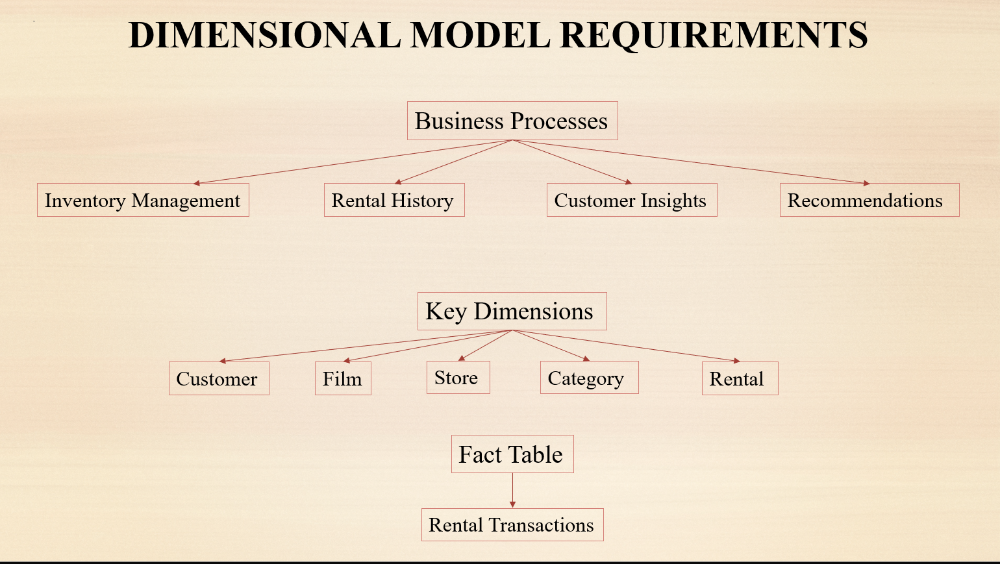
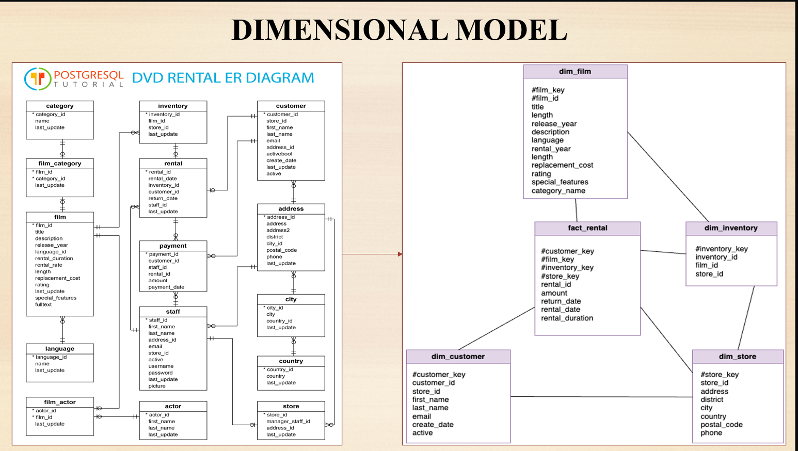
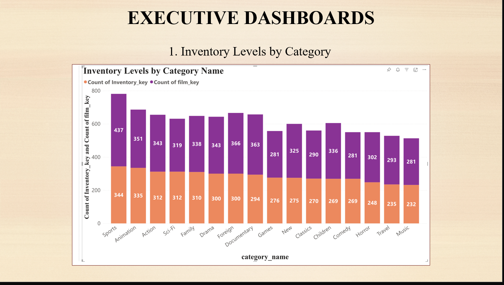
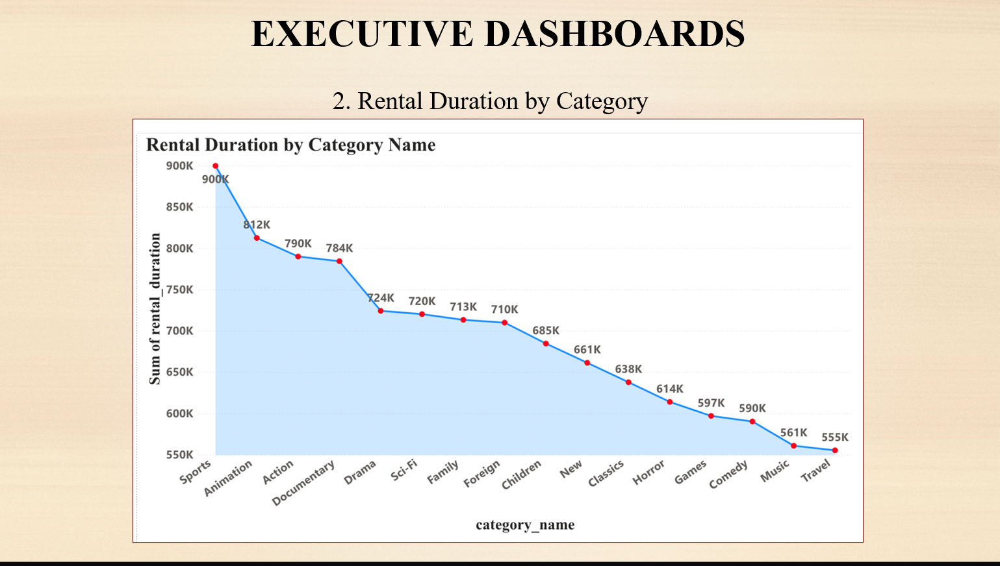
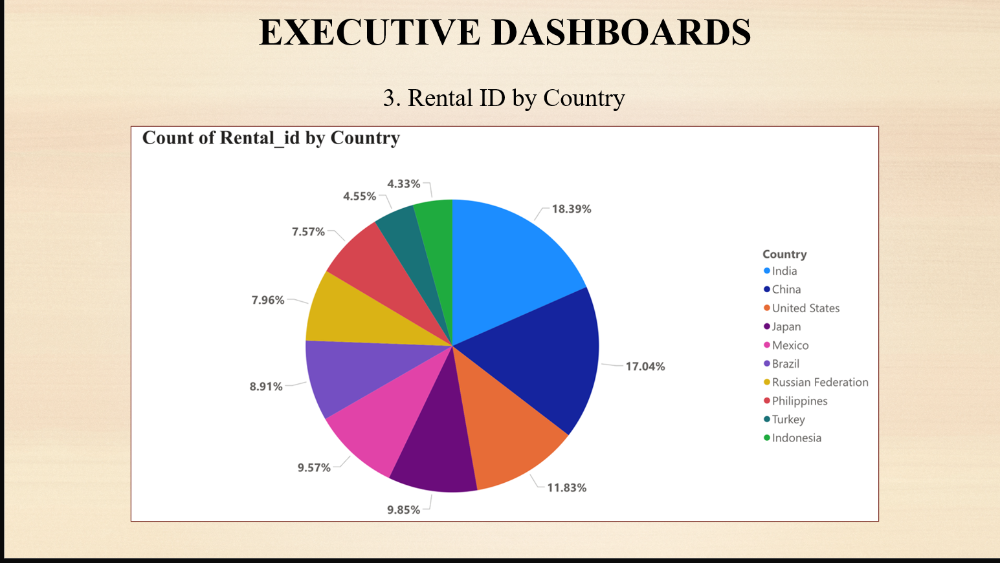
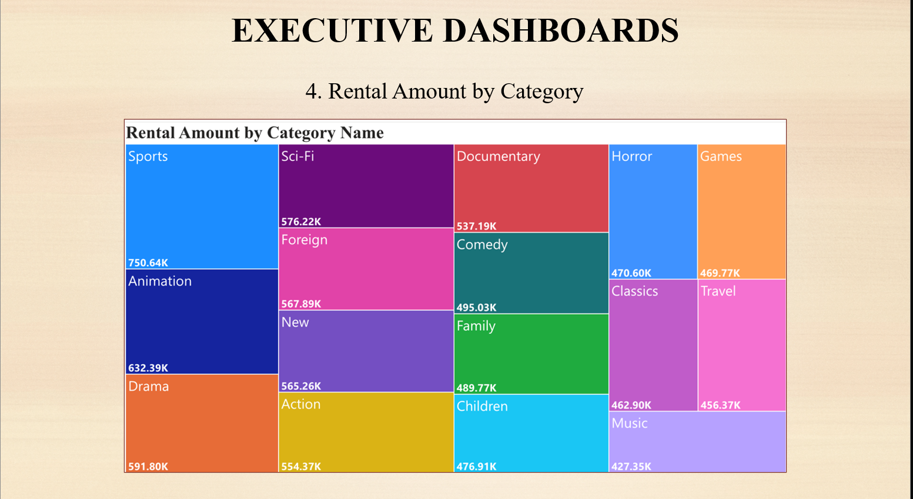
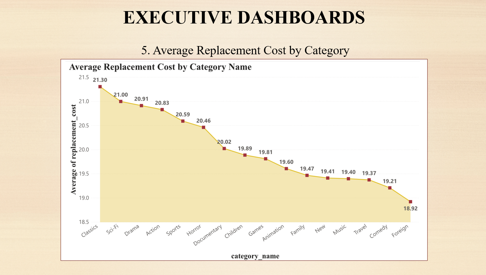
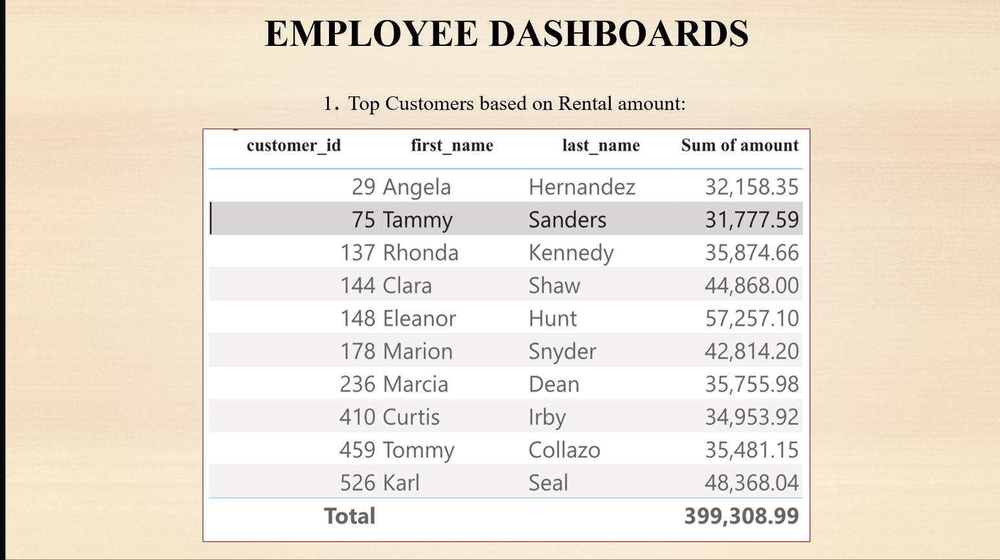
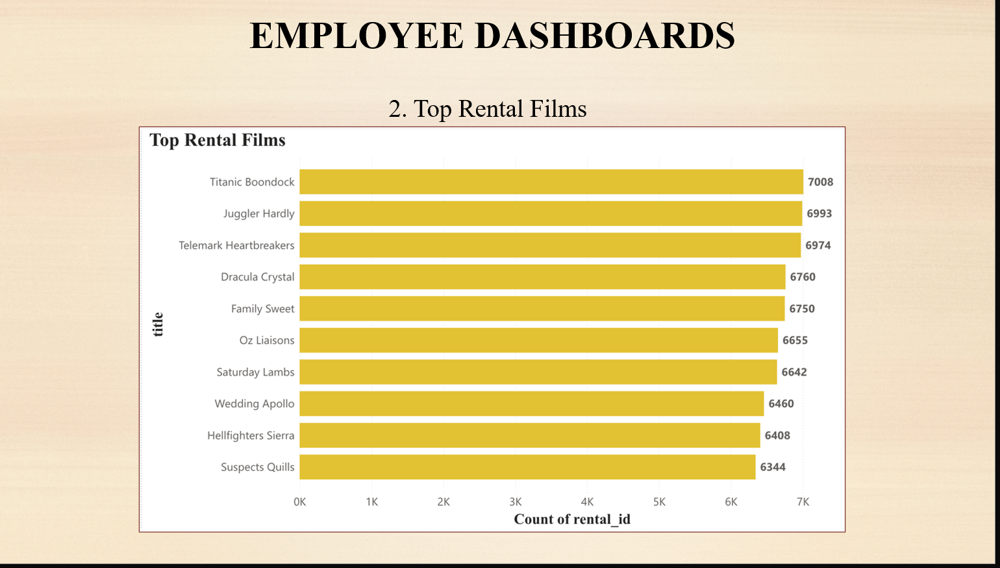
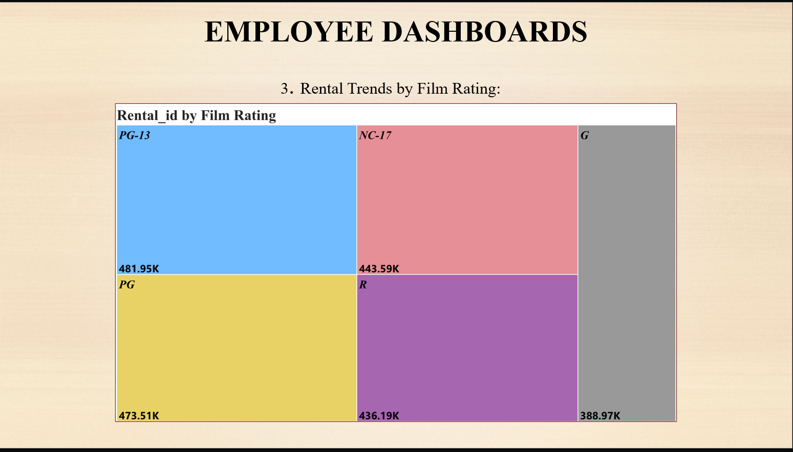

# 🎬 Video World DVD Rentals – Data Warehousing Project

### Data Warehousing   
---

## 📌 Executive Summary

This project designs and implements a **data warehouse** for **Video World**, a DVD rental company with an extensive catalog of movies and TV shows. The goal is to:

- Optimize **DVD inventory management**
- Enhance **customer satisfaction** through personalized recommendations
- Provide **comprehensive analytical insights** for strategic decision-making

The solution is built using a **dimensional model** (star schema) and deployed on **Azure** with interactive dashboards in **Power BI**.

---

## 🏢 About the Organization – Video World

- Established in **2005** as a premier DVD rental service  
- Offers a wide range of **movie and TV titles** across many genres  
- Operates with both **online** and **physical store** presence  
- Focuses on:
  - Maintaining **optimal inventory levels**
  - Delivering **personalized viewing experiences**
  - Using **data-driven decisions** to guide promotions and operations

---

## 🎯 Business Objectives

1. **Optimize Inventory Management**  
   - Track inventory levels by category, film, and store  
   - Reduce **stockouts** and **overstocking**

2. **Enhance Customer Satisfaction & Retention**  
   - Identify top customers and their rental behavior  
   - Provide **personalized recommendations** and targeted promotions  

3. **Support Strategic Decision-Making**  
   - Understand rental trends by **category, geography, and rating**  
   - Analyze **revenue generated** by rentals across segments  

---

## 📐 Dimensional Model Requirements

### Business Processes

The data warehouse is designed to support these core analytical areas:

- **Inventory Management**
  - Inventory levels by category
  - Rental duration analysis
  - Rental trends by geography
  - Rental amount by category
  - Replacement cost by category

- **Customer Insights**
  - Top customers by rental amount
  - Top rented films

### Dimensions

The dimensional model uses **4 dimension tables**:

- `dim_customer`
- `dim_film`
- `dim_store`
- `dim_inventory`


### Fact Table

- `fact_rental` – captures all DVD rental transactions and is the central table in the star schema.

---

## 🧱 Dimensional Model (Star Schema)

### 🧍 dim_customer

Stores customer-level attributes:


- `customer_key` (surrogate key)  
- `customer_id`  
- `store_id`  
- `first_name`, `last_name`  
- `email`  
- `create_date`  
- `active`  

> Used to analyze rental patterns by customer, identify top customers, and segment customer groups.

---

### 🎞️ dim_film

Stores film and category information:

- `film_key` (surrogate key)  
- `film_id`  
- `title`, `description`  
- `release_year`  
- `language`  
- `rental_year`  
- `length`  
- `replacement_cost`  
- `rating`  
- `special_features`  
- `category`  

> Supports analysis of popular films, genres, and categories, and helps optimize purchasing and stocking strategies.

---

### 🏬 dim_store

Contains store-related information:

- `store_key` (surrogate key)  
- `store_id`  
- `address`, `district`, `city`, `country`  
- `postal_code`  
- `phone`  

> Used to analyze geographic rental trends and store performance.

---

### 📦 dim_inventory

Tracks inventory items across stores:

- `inventory_key` (surrogate key)  
- `inventory_id`  
- `film_id`  
- `store_id`  

> Helps monitor inventory distribution and availability per film and per store.

---

### 📊 fact_rental

Captures the **rental transaction grain**:

- `rental_id`  
- `customer_key`  
- `film_key`  
- `inventory_key`  
- `store_key`  
- `rental_date`  
- `return_date`  
- `rental_duration`  
- `amount`  

> This table is the core of the data warehouse, supporting all major analytical queries about rentals, revenue, and customer behavior.

---

## 🏛️ Data Warehouse Architecture

The solution leverages **Azure** and **Power BI** to implement a modern cloud-based data warehouse:

1. **Data Sources**
   - CSV files stored in **Azure Blob Storage** (DVD Rentals dataset)

2. **Data Staging – Lakehouse**
   - Data is extracted from Blob Storage into an **Azure Lakehouse** / **Data Lake Storage (bronze layer)**  
   - Raw tables stored individually to preserve original structure

3. **Data Transformation – Silver Layer**
   - Transformations performed using **Azure Synapse / Fabric pipelines**:
     - Join normalized OLTP tables (customer, address, city, country, etc.)
     - Remove junk/unneeded columns
     - Create denormalized **dimensional tables** (dim_customer, dim_film, dim_inventory, dim_store)
     - Add surrogate keys (`*_key`)

4. **Data Warehouse – Presentation Layer**
   - Final **dimensional tables** and **fact_rental** loaded into a **SQL data warehouse** (Azure Synapse / Fabric Warehouse)
   - Pre-calculated metrics:
     - Rental duration (`return_date - rental_date`)
     - Amount (from payment table)

5. **Analytics & Visualization**
   - **Power BI** connects to the data warehouse  
   - Interactive dashboards built for:
     - Executives – inventory and high-level KPIs  
     - Employees – customer/film-focused analytics  

---

## 🔄 ETL Pipelines

Example pipeline design (names as used in Azure):

- **Pipeline 1 – Extraction**  
  `pl_extract_dvd_rentals_data_to_lakehouse`  
  - Pulls CSV data from Azure Blob Storage to the **bronze** layer in the lakehouse.

- **Pipeline 2 – Transform Customer → dim_customer**  
  - Joins `customer` with `address`, `city`, and `country`  
  - Removes technical columns (`country_id`, `city_id`, `address_id`, `address2`)  
  - Adds `customer_key` and writes **Silver_Dim_Customer**.

- **Pipeline 3 – Transform Film → dim_film**  
  - Joins `film` with `film_actor`, `film_category`, `actor`, `category`, and `language`  
  - Removes columns like `full_text`, `film_category_id`, `actor_id`, etc.  
  - Adds `film_key` and writes **Silver_Dim_Film**.

- **Pipeline 4 – Transform Inventory → dim_inventory**  
  - Cleans inventory data, removes `last_update`  
  - Adds `inventory_key` and writes **Silver_Dim_Inventory**.

- **Pipeline 5 – Transform Store → dim_store**  
  - Joins `store` with `address`, `city`, `country`  
  - Drops IDs and `last_update`, adds `store_key`.

- **Pipeline 6 – Load fact_rental**  
  `pl_load_fact_rental_to_warehouse`  
  - Joins `rental` with **Silver** dimension tables and `payment`  
  - Computes `rental_duration` and `amount`  
  - Loads into `fact_rental` in the warehouse.

---

## 📊 Dashboards & Analysis

### 👔 Executive Dashboards (Inventory & Strategy)

1. **Inventory Levels by Category**  
   - Stacked bar chart  
   - Shows inventory count per film category  
   - Identifies overstocked and understocked genres
    

2. **Rental Duration by Category**  
   - Area chart  
   - Aggregated rental duration per category  
   - Highlights genres with longest engagement time
   - 

3. **Rental Count by Country**  
   - Pie chart / map visualization  
   - Compares rental volume across countries  
   - Supports regional marketing and stocking decisions
     

4. **Rental Amount by Category**  
   - Treemap  
   - Shows revenue contribution by genre  
   - Helps prioritize profitable categories
    

5. **Average Replacement Cost by Category**  
   - Line chart  
   - Displays average replacement cost per genre  
   - Useful for budgeting and inventory risk assessment
  
---

### 👥 Employee Dashboards (Customer & Film Insights)

1. **Top Customers by Rental Amount**  
   - Table of top-spending customers  
   - Includes customer ID, name, and total rental amount  
   - Supports loyalty programs and targeted promotions

2. **Top Rented Films**  
   - Horizontal bar chart  
   - Lists top 10 most rented titles  
   - Helps identify high-demand films and guide purchasing decisions

3. **Rental Trends by Film Rating** (optional view)  
   - Visualizes rental counts by MPAA rating (e.g., PG, PG-13, R)  
   - Assists in understanding audience preferences.

---

## ✅ Outcomes & Conclusion

The Video World DVD Rentals data warehouse:

- **Improves inventory management**
  - Clear view of stock levels and high-demand categories  
  - Reduction in stockouts and overstock scenarios  

- **Enhances customer satisfaction**
  - Insights into top customers and popular films  
  - Enables personalized recommendations and targeted campaigns  

- **Supports data-driven strategic decisions**
  - Executive-friendly dashboards and KPIs  
  - Better understanding of rental trends by region, category, and rating  

Overall, the project provides a **robust, scalable, and analytical platform** that transforms raw rental data into actionable insights for Video World.

---

## 📁 Suggested Repository Structure

```text
📂 video-world-dvd-rentals-dwh
 ├── 📄 README.md
 ├── 📄 DVD_Rentals_Summary_Report.pdf
 ├── 📄 Video_World_Presentation.pptx
 ├── 📂 sql/
 │    ├── create_dim_tables.sql
 │    ├── create_fact_rental.sql
 │    ├── sample_queries.sql
 ├── 📂 pipelines/
 │    ├── pl_extract_dvd_rentals_data_to_lakehouse.json
 │    ├── pl_transform_customer_to_silver_dim_customer.json
 │    ├── pl_transform_film_to_silver_dim_film.json
 │    ├── pl_transform_inventory_to_silver_dim_inventory.json
 │    ├── pl_transform_store_to_silver_dim_store.json
 │    ├── pl_load_fact_rental_to_warehouse.json
 ├── 📂 dashboards/
 │    ├── executive_dashboard.pbix
 │    ├── employee_dashboard.pbix
 └── 📂 images/
      ├── dimensional_model.png
      ├── architecture_diagram.png
      ├── sample_dashboard_inventory.png
